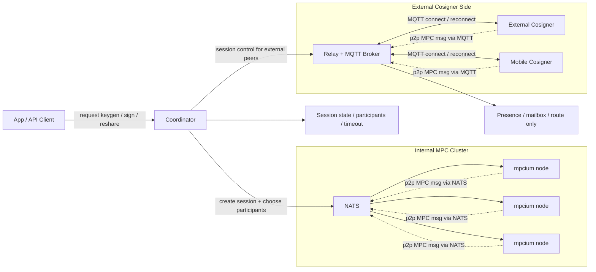
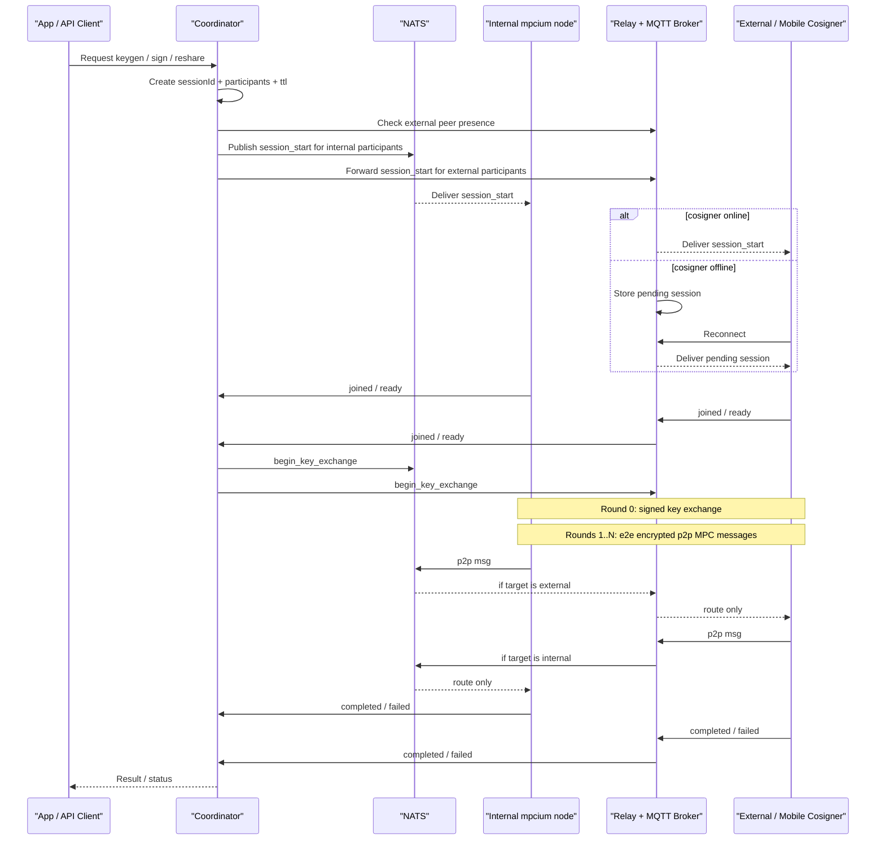
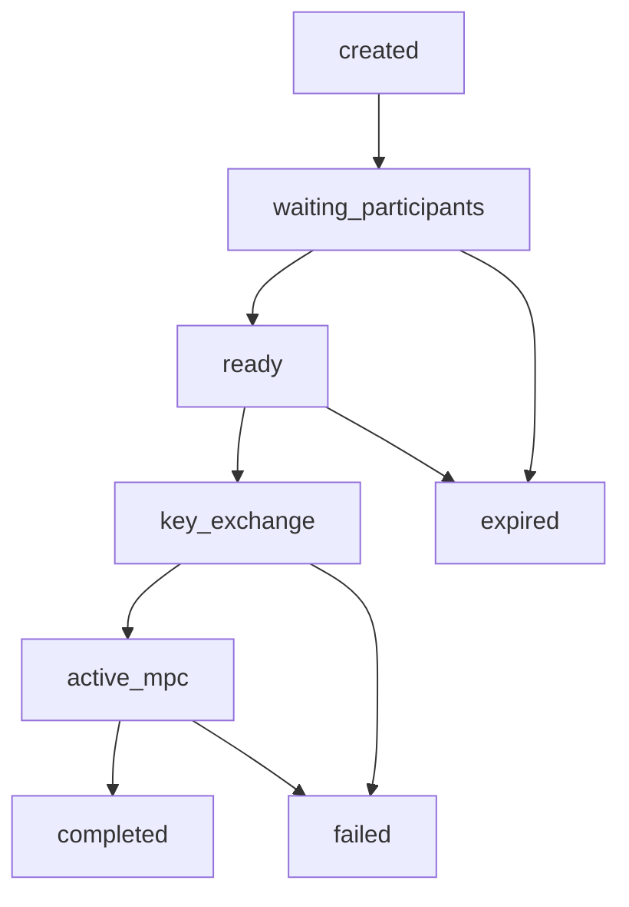

# External And Mobile Cosigner Runtime Design

## Status
Draft

## Date
2026-04-16

## Summary
This document captures the current design proposal for supporting external cosigners and mobile cosigners through a new runtime model.

Core direction:

- Internal `mpcium node` workers continue to communicate over `NATS`.
- External and mobile cosigners connect through `MQTT`.
- `Relay` is also the MQTT broker, but it is transport-only.
- `Coordinator` is the control-plane authority for request intake, session management, participant selection, and lifecycle transitions.
- MPC packets are end-to-end peer-to-peer messages after a dedicated key exchange round.

## Problem Statement
The current model assumes requests such as `keygen`, `sign`, and `reshare` are published into `NATS`, and internal nodes consume them directly.

That model is not sufficient once we introduce:

- external cosigner services
- mobile cosigners
- uncertain peer connectivity over MQTT
- store-and-forward behavior for offline external peers
- a dedicated key exchange round before encrypted MPC traffic starts

## Goals

- Support internal participants over `NATS`.
- Support external and mobile participants over `MQTT`.
- Keep MPC traffic end-to-end encrypted between participants.
- Allow offline external peers to reconnect and resume through relay mailbox behavior.
- Separate control-plane concerns from transport concerns.
- Keep the data plane simple enough for a new runtime implementation.

## Non-Goals

- Relay does not execute MPC logic.
- Relay does not decrypt MPC payloads.
- Coordinator does not inspect or process MPC round payloads.
- Mobile or end-user apps do not own session truth.

## High-Level Decisions

1. Introduce a dedicated `Coordinator` runtime.
2. Keep `Relay` separate from `Coordinator` at the responsibility level.
3. Keep `mpcium node` as a worker runtime, not a session authority.
4. Introduce a dedicated `Round 0` key exchange before normal MPC rounds.
5. Treat all MPC round packets after key exchange as end-to-end encrypted peer-to-peer messages.
6. Use versioned topic namespaces for the new runtime instead of reusing the current ad-hoc subject format.
7. Start with coordinator fan-out for control messages instead of a dedicated control broadcast topic.

## Runtime Layout

### Coordinator
Owns the control plane.

Responsibilities:

- receive `keygen`, `sign`, and `reshare` requests
- create `sessionId`
- choose participant set
- check peer presence
- send control messages to internal and external peers
- manage session state
- enforce timeout, abort, and completion rules

### Relay
Owns transport for external peers.

Responsibilities:

- act as MQTT broker
- track online and offline status
- expose peer presence
- hold pending messages for offline peers
- forward messages by `sessionId` and `peerId`

Explicitly out of scope:

- no session ownership
- no participant selection
- no MPC computation
- no payload decryption

### MPCIUM Node
Owns internal MPC worker behavior.

Responsibilities:

- join assigned sessions
- perform signed key exchange
- run MPC rounds
- emit lifecycle events such as ready, failed, completed

### External Cosigner / Mobile Cosigner
Own the same participant-side behavior as internal nodes, but connect through MQTT via relay.

Responsibilities:

- connect and reconnect through relay
- receive control messages
- join sessions
- perform signed key exchange
- run MPC rounds
- emit lifecycle events

## Control Plane And Data Plane

### Control Plane
Owned by `Coordinator`.

Used for:

- request intake
- session creation
- participant assignment
- presence checks
- session start
- begin key exchange
- abort and timeout
- completion and failure aggregation

### Data Plane
Owned by participants plus transport.

Used for:

- peer-to-peer key exchange hello messages
- encrypted MPC round packets

Key rule:

- `Coordinator` manages session lifecycle but never reads MPC packet bodies.
- `Relay` forwards packets but never interprets MPC semantics.

## Proposed Deployment

- `coordinator-runtime`
- `relay-runtime`
- `mpcium node`
- `external cosigner`
- `mobile cosigner`

The coordinator may initially be deployed in the same environment as internal services, but it should remain a separate runtime or module from both relay and worker nodes.

## Architecture Diagram



## Session Flow



## Session Lifecycle



## Topic Namespace

### Design Principles

- All new runtime topics are versioned.
- Topic naming should be transport-neutral at the logical level.
- `NATS` and `MQTT` use the same logical structure with different separators.
- Each peer has a stable control inbox and a session-scoped p2p inbox.
- Phase 1 avoids broadcast topics for control messages. Coordinator fans out control messages to each participant inbox.

### Logical Namespace

- `request.<op>`
- `peer.<peerId>.control`
- `peer.<peerId>.session.<sessionId>.p2p`
- `session.<sessionId>.event`
- `peer.<peerId>.presence`

### Transport Mapping

| Purpose | NATS | MQTT |
| --- | --- | --- |
| Keygen request | `mpc.v1.request.keygen` | not required |
| Sign request | `mpc.v1.request.sign` | not required |
| Reshare request | `mpc.v1.request.reshare` | not required |
| Peer control inbox | `mpc.v1.peer.<peerId>.control` | `mpc/v1/peer/<peerId>/control` |
| Peer p2p inbox | `mpc.v1.peer.<peerId>.session.<sessionId>.p2p` | `mpc/v1/peer/<peerId>/session/<sessionId>/p2p` |
| Session event stream | `mpc.v1.session.<sessionId>.event` | `mpc/v1/session/<sessionId>/event` |
| Peer presence | `mpc.v1.peer.<peerId>.presence` | `mpc/v1/peer/<peerId>/presence` |

### Relay Bridge Expectations

Relay should bridge:

- external peer control inboxes
- external peer p2p inboxes
- presence events
- session lifecycle events from external participants back to coordinator

Relay should not mutate session payload shape.

## Message Model

All messages use an envelope with explicit versioning and typed payloads.

### Control Envelope

```json
{
  "v": 1,
  "type": "session.start",
  "session_id": "sess_01HXYZ",
  "op": "sign",
  "request_id": "req_01HXYZ",
  "correlation_id": "corr_01HXYZ",
  "from": "coordinator",
  "to": "peer-mobile-01",
  "ts": "2026-04-16T10:00:00Z",
  "ttl_sec": 120,
  "sig": "base64(coordinator_signature)",
  "body": {}
}
```

Control message types:

- `session.start`
- `session.abort`
- `session.cancel`
- `session.resume`
- `key_exchange.begin`

### P2P Envelope

```json
{
  "v": 1,
  "type": "mpc.packet",
  "session_id": "sess_01HXYZ",
  "op": "sign",
  "from": "peer-node-01",
  "to": "peer-mobile-01",
  "round": 2,
  "seq": 14,
  "ts": "2026-04-16T10:00:08Z",
  "encryption": {
    "alg": "x25519-chacha20poly1305",
    "kid": "kx_01",
    "nonce": "base64(...)"
  },
  "ciphertext": "base64(...)"
}
```

### Session Event Envelope

```json
{
  "v": 1,
  "type": "peer.joined",
  "session_id": "sess_01HXYZ",
  "op": "sign",
  "from": "peer-mobile-01",
  "ts": "2026-04-16T10:00:03Z",
  "body": {}
}
```

Session event types:

- `peer.joined`
- `peer.ready`
- `peer.key_exchange_done`
- `peer.failed`
- `session.completed`
- `session.failed`
- `session.timed_out`

### Presence Event

```json
{
  "v": 1,
  "type": "peer.presence",
  "peer_id": "peer-mobile-01",
  "status": "online",
  "transport": "mqtt",
  "conn_id": "conn_8f3a",
  "last_seen_at": "2026-04-16T10:00:01Z"
}
```

## Suggested Message Bodies

### session.start

```json
{
  "threshold": 2,
  "participants": [
    { "peer_id": "peer-node-01", "transport": "nats" },
    { "peer_id": "peer-node-02", "transport": "nats" },
    { "peer_id": "peer-mobile-01", "transport": "mqtt" }
  ],
  "key_type": "secp256k1",
  "payload": {
    "wallet_id": "wallet_123",
    "tx_id": "tx_456",
    "tx_hash": "0xabc"
  }
}
```

### key_exchange.begin

```json
{
  "exchange_id": "kx_01",
  "curve": "x25519",
  "participants": [
    "peer-node-01",
    "peer-node-02",
    "peer-mobile-01"
  ]
}
```

### key_exchange.hello

This message is sent peer-to-peer during round 0. It is not encrypted yet, but it must be signed by the sender identity.

```json
{
  "v": 1,
  "type": "key_exchange.hello",
  "session_id": "sess_01HXYZ",
  "from": "peer-mobile-01",
  "to": "peer-node-01",
  "ts": "2026-04-16T10:00:05Z",
  "body": {
    "exchange_id": "kx_01",
    "identity_key_id": "id_mobile_01",
    "ephemeral_pubkey": "base64(...)"
  },
  "sig": "base64(peer_identity_signature)"
}
```

## Security Model

- Control messages are signed by `Coordinator`.
- Key exchange hello messages are signed by the sender identity.
- All MPC packets after key exchange are end-to-end encrypted.
- `Relay` must only route based on metadata such as target peer and session.
- AEAD additional authenticated data should bind at least:
  - `session_id`
  - `from`
  - `to`
  - `round`
  - `seq`

## Session Ownership Rules

- `Coordinator` is the single authority for session lifecycle.
- `Relay` may expose presence and mailbox state, but it is not the session owner.
- `mpcium node` workers do not decide session creation or participant assignment.
- External cosigners and mobile cosigners do not own global session truth.

## Why Coordinator Is Not Relay

`Relay` and `Coordinator` should remain separate responsibilities because they scale and fail differently.

- Relay scales with connections and message forwarding.
- Coordinator scales with active session count and lifecycle state.
- Relay should remain transport-focused.
- Coordinator should remain control-focused.

They may be co-located in early deployment, but the boundary should stay explicit in code and APIs.

## Why Coordinator Is Not The MPC Node

`mpcium node` should remain a worker runtime.

If every node also acts as coordinator, the system must solve duplicate orchestration, leader election, and split-brain. That adds control-plane complexity into the worker path and makes debugging much harder.

A separate coordinator runtime keeps:

- one session authority
- simpler workers
- clearer retry and timeout behavior
- cleaner protocol boundaries

## Open Questions

- What is the external request interface for coordinator: HTTP, gRPC, or NATS request-reply?
- How long should pending session and pending control messages stay in relay mailbox?
- Should `session.<sessionId>.event` live only on NATS, or also be mirrored to MQTT for external debugging and observability?
- Do we need resumable session tokens for mobile reconnect flows?
- How should coordinator persist session state: in-memory plus snapshot, Redis, Consul, or another store?
- Should key exchange use one derived pairwise key per peer pair for the whole session, or support key rotation per phase?
- Do we want a dedicated event for delivery acknowledgment from relay to coordinator?

## Suggested Next Steps

1. Finalize the coordinator request API.
2. Define protobuf or JSON schemas for the envelope and message bodies in this document.
3. Define relay presence and mailbox behavior in more detail.
4. Implement the control-plane state machine in the coordinator runtime.
5. Implement the new topic namespace and transport bridge behavior.
6. Integrate round 0 key exchange into the participant runtimes.

## Suggested Implementation Order

The implementation should not start with full end-to-end signing.

Even though `keygen` must happen before real `sign`, the first milestone should focus on the shared runtime foundation that both operations need.

### Phase 1: Control Plane Foundation

Implement:

- coordinator runtime skeleton
- session store with in-memory state
- request intake
- participant selection
- session lifecycle states
- control message fan-out
- session event handling

Deliverable:

- coordinator can create a session and drive participants through `created -> waiting_participants -> ready`

### Phase 2: Relay Foundation

Implement:

- relay runtime skeleton
- MQTT broker integration
- external peer presence
- online and offline tracking
- control message forwarding

Deliverable:

- external peers can connect, expose presence, and receive control messages through relay

### Phase 3: Participant Control Integration

Implement:

- internal worker subscription to control inbox
- external cosigner subscription to control inbox
- `session.start`
- `peer.joined`
- `peer.ready`
- basic timeout and abort handling

Deliverable:

- coordinator can start a session and collect participant readiness from both internal and external peers

### Phase 4: Round 0 Key Exchange

Implement:

- `key_exchange.begin`
- `key_exchange.hello`
- signed identity verification
- pairwise key derivation
- `peer.key_exchange_done`

Deliverable:

- all participants derive session keys and coordinator can transition a session into `active_mpc`

### Phase 5: Generic P2P Transport

Implement:

- session-scoped p2p inbox
- internal transport over NATS
- external transport over MQTT through relay
- metadata-based routing in relay
- encrypted packet envelope

Deliverable:

- participants can exchange encrypted p2p packets over the new transport without yet running full MPC

### Phase 6: MPC Operation Integration

At this point, integrate real MPC operations in dependency order:

1. `keygen`
2. `sign`
3. `reshare`

Rationale:

- `keygen` creates the key material needed by later operations
- `sign` depends on existing key material
- `reshare` depends on both lifecycle control and participant-change handling

### Phase 7: Reliability And Recovery

Implement:

- relay mailbox
- offline replay for external peers
- session persistence
- reconnect and resume behavior
- delivery acknowledgment if needed
- observability and tracing

Deliverable:

- the runtime can recover from disconnects and partial failures with predictable behavior
